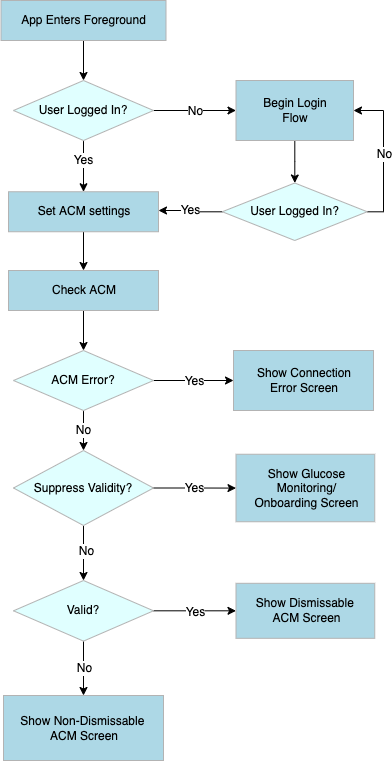
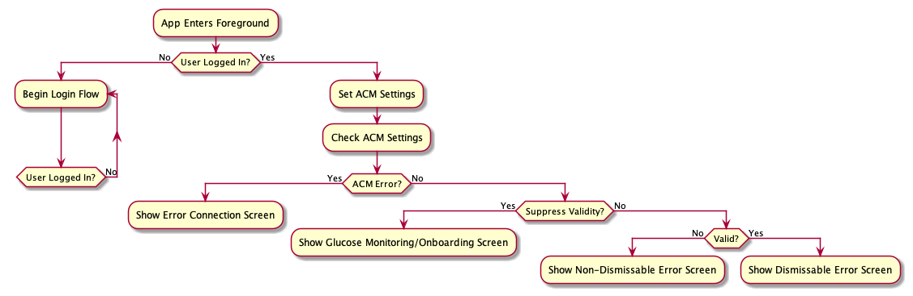
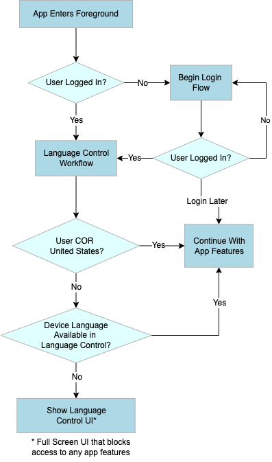
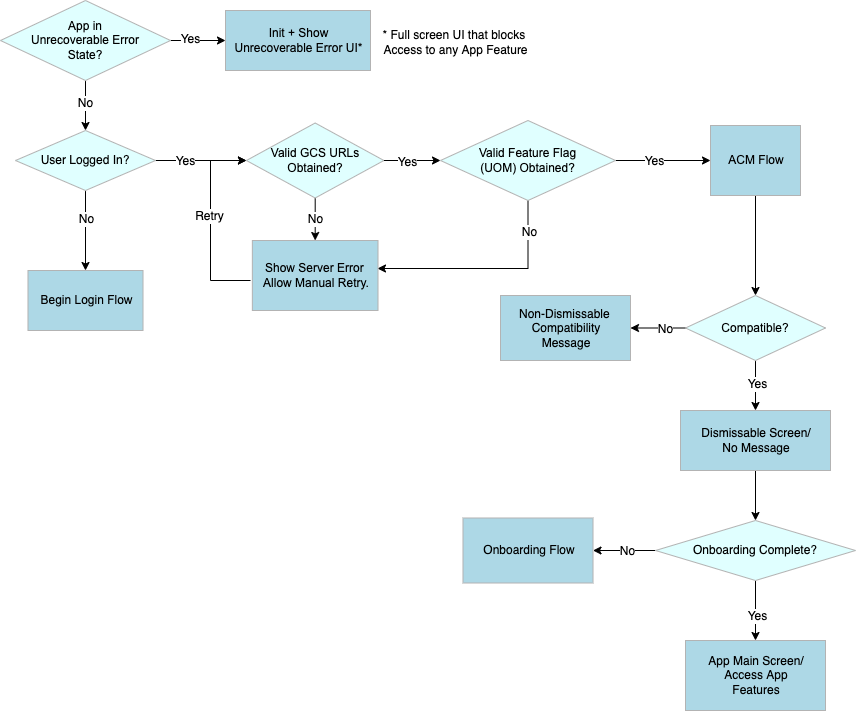
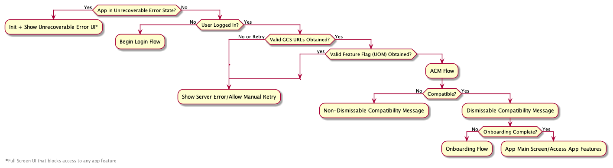
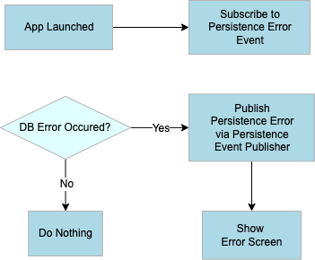
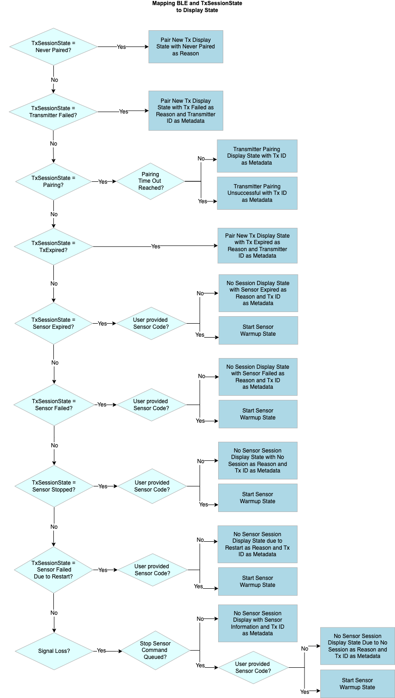
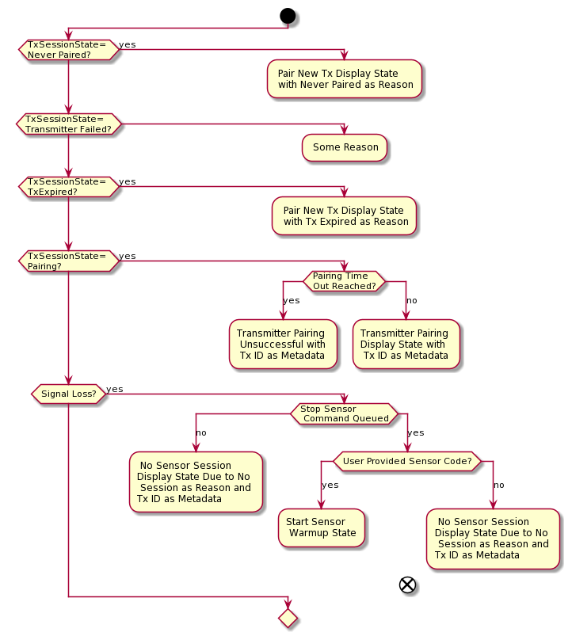
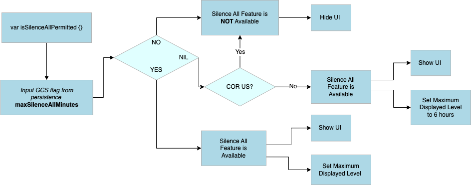
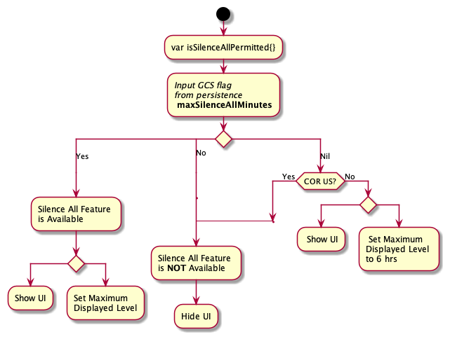

# SDS Flow Charts

# ACM Workflow

{ width=300 margin=auto } { width=300 margin=auto }

## [ACMWorkflow.puml](../diagrams/ACMWorkflow.puml)

## Source

# ELC Workflow Post Onboarding

{ width=300 margin=auto } { width=300 margin=auto }

## [ELCWorkflowPostOnboarding.puml](../diagrams/ELCWorkflowPostOnboarding.puml)

# UI Decision Tree

{ width=300 margin=auto } { width=300 margin=auto }

## [UIDecisionTree.puml](../diagrams/UIDecisionTree.puml)

# Database Error Workflow

{ width=300 margin=auto } { width=300 margin=auto }

## [DatabaseErrorWorkflow.puml](../diagrams/DatabaseErrorWorkflowUML.puml)

# Tx Session State Mapping

{ width=300 margin=auto } { width=300 margin=auto }
 

## [MaintainingCommunication_TxSessionStateMapping.puml](../diagrams/MaintainingCommunication_TxSessionStateMapping.puml)

# Quiet Mode Silence All - App Request Flow

{ width=500 margin=auto }

## [QuietModesSilenceAll-AppRequestFlow.puml](../diagrams/QuietModesSilenceAll-AppRequestFlow.puml)
