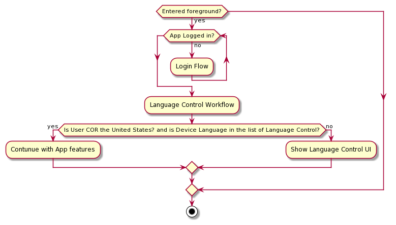

# SDS Flow Charts

# ACM Workflow

 

## [ACMWorkflow.puml](../diagrams/ACMWorkflow.puml)

{ width=500 margin=auto }

## Source

# ELC Workflow Post Onboarding

 

## [ELCWorkflowPostOnboarding.puml](../diagrams/ELCWorkflowPostOnboarding.puml)

{ width=500 margin=auto }

# UI Decision Tree

## [UIDecisionTree.puml](../diagrams/UIDecisionTree.puml)

{ width=500 margin=auto }

# Database Error Workflow

 

## [DatabaseErrorWorkflow.puml](../diagrams/DatabaseErrorWorkflow.puml)

{ width=500 margin=auto }

# Tx Session State Mapping

  

## [MaintainingCommunication_TxSessionStateMapping.puml](../diagrams/MaintainingCommunication_TxSessionStateMapping.puml)

{ width=500 margin=auto }

